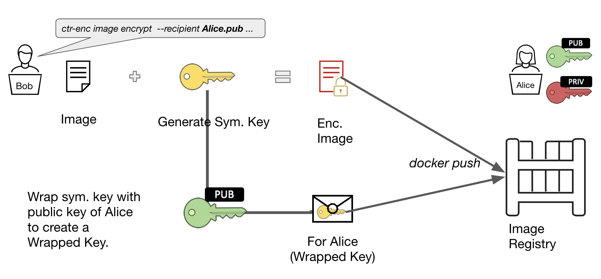

# Encrypting container images with containerd/imgcrypt!

Just recently, we upstreamed the encrypted container images officially as a [non-core containerd project](https://github.com/containerd/imgcrypt)! In this blogpost, we will introduce what exactly container image encryption does, and how you can play around with it!

## What are Encrypted Container Images?

Like Virtual Machine (VM) images, containers images contain code and data which are used by the applications we deploy. More often than not, our code may contain sensitive data - be it propreitary algorithms or machine learning models. The motivation behind encrypted container images is to provide a way for developers and operators to encrypt sensitive code.

The two common usecases for encryption are:
- Ensure confidentiality of data - i.e. encrypted data at rest for compliance, or storing sensitive code on public registries like Docker hub or quay.io.
- Provide high assurance constructs for geofencing and image use - if an organization has good key management, it can provide high assurance that only certain machines/locations/users that have access to a key can use images.

The goal of the project was to provide encryption capabilities to container images, ensuring that we stick to the cloud native philosophy. 

Traditionally, when encryption comes to mind, there is an association of a decrease in efficiency and observerability. However, in our design and development, we prioritize retaining the ideas that everyone likes about container images: like layering and deduplication. In addition, we ensure that we will be able to work with other tooling in the container security ecosystem like vulnerability analyzers and image signing. All in a secure way!


## What is in an encrypted container image?

Encrypted container images are based on the [OCI image spec](https://github.com/opencontainers/image-spec). The changes to the spec is the adding of the encrypted mediatype layers. An image manifest contains some metadata and a list of layers. We create a new layer mediatype suffix `+encrypted` to represent an encrypted layer, so a regular layer with mediatype `application/vnd.oci.image.layer.v1.tar` when encrypted would be `application/vnd.oci.image.layer.v1.tar+encrypted`.

Because there is some metadata involved with the encryption, an encrypted layer will also contain several annotations with the prefix `org.opencontainers.image.enc`.

Therefore an original layer that looks like:

```
"layers":[
  {
    "mediaType":"application/vnd.oci.image.layer.v1.tar+gzip",
    "digest":"sha256:7c9d20b9b6cda1c58bc4f9d6c401386786f584437abbe87e58910f8a9a15386b",
    "size":760770
  }
]
```

When encrypted will become:

```
"layers":[
  {
    "mediaType":"application/vnd.oci.image.layer.v1.tar+gzip+encrypted",
    "digest":"sha256:c72c69b36a886c268e0d7382a7c6d885271b6f0030ff022fda2b6346b2b274ba",
    "size":760770,
    "annotations": {
      "org.opencontainers.image.enc.keys.jwe":"eyJwcm90ZWN0Z...",
      "org.opencontainers.image.enc.pubopts":"eyJjaXBoZXIiOi..."
    }
  }
]
```

By performing encryption on the layer instead of the entire image. We are able to encrypt only specific layers which contain sensitive code. This way, we can still benefit from deduplication, as in most cases, the lower layers (i.e. operating system and middleware) do not have to be encrypted!


## Data Encryption and Key Authorization/Distribution

Encrypted container images use both symmetric and assymetric encryption schemes. It uses symmetric encryption (i.e. AES) to perform encryption on the layer data blobs for speed, and assymetric encryption and [public key cryptography](https://en.wikipedia.org/wiki/Public-key_cryptography) to determine authorization to decrypt the images.

More specifically, when encrypting an image, symmetric keys are generated, which are used to encrypt the layers' data. These keys are then wrapped/encrypted with the public key of the receipient who will then be able to decrypt the data. The wrapped keys and encrypted data are public information which can then get uploaded to the registry.

Here is an example of the flow of an image owner, Bob, who wants to encrypt an image for his friend, Alice. In this case, Bob will obtain Alice's public key and use it to encrypt the image. 



We note that the annotations that we saw in the spec definition earlier contains a combination of the settings of the encryption algorithms used, as well as the wrapped keys produced when encrypting the layers. For a deeper view of the the encryption scheme, please check out the [OCI spec encryption PR](https://github.com/opencontainers/image-spec/pull/775).

This works well with introspection and other similar tools and the owner of the image is able to specify multiple recipients. In this case, we can specify Alice's public key, along with the public key of a trusted image scanning service. This will allow introspection and scanning tools to work while the image is encrypted.

Now that we've got some context, let's go ahead and encrypt some images!

## Let's encrypt some images!

With the project [imgcrypt](https://github.com/containerd/imgcrypt), we provide the `ctr-enc` CLI to play around with how encrypted containe images work - and how they interact with containerd. Here's how to get started!

### Requirements

The only requirements on top of the standard golang environment is:
- [containerd version 1.3](https://github.com/containerd/containerd/tree/v1.3.0) and above installed
- openssl
- docker (optional: if you would like to set up your own local registry)
- gpg (optional:  only if encryption with GPG is required)


### Buidling `ctr-enc` and `ctd-decoder`

We first build the binaries required in [`containerd/imgcrypt`](https://github.com/containerd/imgcrypt)

```
$ make && sudo make install
```

We note that make install will install `ctd-decoder` and `ctr-enc` into `/usr/local/bin`. The two binaries are:

- `ctr-enc`: A CLI tool alike to containerd `ctr` but with encrypted image flags built-in.
- `ctd-decoder`: A stream processing binary that handles decryption of encrypted layer input stream.

### Setting up containerd

The first step of playing around with encrypted container images is to setup the containerd daemon. The changes here are to configure [stream processor plugins](https://github.com/containerd/containerd/blob/v1.3.0/docs/stream_processors.md) that were introduced in version 1.3. 

We want to add an entry to tell containerd stream processor that if it sees a layer with an encrypted mediatype, it should send it out through to our decryption processor, `ctd-decoder`. This can be done by adding the following lines to the containerd config file (i.e. /etc/containerd/config.toml). An example of a config file would be the following:

```
disable_plugins = ["cri"]
[grpc]
  uid = 0
  gid = 0

# Add the following lines here for stream processor
[stream_processors]
    [stream_processors."io.containerd.ocicrypt.decoder.v1.tar.gzip"]
        accepts = ["application/vnd.oci.image.layer.v1.tar+gzip+encrypted"]
        returns = "application/vnd.oci.image.layer.v1.tar+gzip"
        path = "/usr/local/bin/ctd-decoder"
    [stream_processors."io.containerd.ocicrypt.decoder.v1.tar"]
        accepts = ["application/vnd.oci.image.layer.v1.tar+encrypted"]
        returns = "application/vnd.oci.image.layer.v1.tar"
        path = "/usr/local/bin/ctd-decoder"
```

Containerd daemon should be relaunched with the new config file

```
$ sudo containerd -c /etc/containerd/config.toml
```

### Encrypting an image

#### Creating some keys
We will generate some RSA keys with openssl. The following commands will generate a public and private key pair. 

```
$ openssl genrsa --out mykey.pem
Generating RSA private key, 2048 bit long modulus (2 primes)
...............................................+++++
............................+++++
e is 65537 (0x010001)
$ openssl rsa -in mykey.pem -pubout -out mypubkey.pem
writing RSA key
```

#### Pulling an image

We will download an image to encrypt:

```
$ sudo ctr-enc images pull --all-platforms docker.io/library/bash:latest
[... truncated ...]
```

We can then use the added `ctr-enc image layerinfo` command to view encryption information on the image. Naturally, we see that there isn't any encryption on the image.

```
$ sudo ctr-enc images layerinfo --platform linux/amd64 docker.io/library/bash:latest
   #                                                                    DIGEST      PLATFORM      SIZE   ENCRYPTION   RECIPIENTS
   0   sha256:9d48c3bd43c520dc2784e868a780e976b207cbf493eaff8c6596eb871cbd9609   linux/amd64   2789669                          
   1   sha256:7dd01fd971d4ec7058c5636a505327b24e5fc8bd7f62816a9d518472bd9b15c0   linux/amd64   3174665                          
   2   sha256:691cfbca522787898c8b37f063dd20e5524e7d103e1a3b298bd2e2b8da54faf5   linux/amd64       340                          
```

#### Encrypting the image


By using the `ctr-enc images encrypt` command we can encrypt the existing image to a new tag. The arguments are:
- `--recipient jwe:mypubkey.pem`: This indicates that we want to encrypt the image using the public key `mypubkey.pem` that we just regenerated, and the prefix `jwe:` indicates that we want to use the encryption scheme [JSON web encryption scheme](https://tools.ietf.org/html/rfc7516) for our encryption metadata.
- `--platform linux/amd64`: Encrypt only the `linux/amd64` image
- `docker.io/library/bash:latest` - The image to encrypt
- `bash.enc:latest` - The tag of the encrypted image to be created
- optional: it is possible to encrypt just certain layers of the image by using the `--layer` flag

```
$ sudo ctr-enc images encrypt --recipient jwe:mypubkey.pem --platform linux/amd64 docker.io/library/bash:latest bash.enc:latest
Encrypting docker.io/library/bash:latest to bash.enc:latest
```

We can observe the layerinfo to show the encryption:

```
$ sudo ctr-enc images layerinfo --platform linux/amd64 bash.enc:latest
   #                                                                    DIGEST      PLATFORM      SIZE   ENCRYPTION   RECIPIENTS
   0   sha256:360be141b01f69b25427a9085b36ba8ad7d7a335449013fa6b32c1ecb894ab5b   linux/amd64   2789669          jwe        [jwe]
   1   sha256:ac601e66cdd275ee0e10afead03a2722e153a60982122d2d369880ea54fe82f8   linux/amd64   3174665          jwe        [jwe]
   2   sha256:41e47064fd00424e328915ad2f7f716bd86ea2d0d8315edaf33ecaa6a2464530   linux/amd64       340          jwe        [jwe]
```

#### Pushing to registry

Let us set up a local registry that we can push the encrypted image to. Note that by default, the [`docker/distribution`](https://github.com/docker/distribution) registry version 2.7.1 and above supports encrypted OCI images out of the box. 

Note: as of present, current Docker Hub registry version does not take the encrypted OCI images. IBM Container Registry does support it if you wish to skip setting up your own registry.

```
$ sudo docker run -d -p 5000:5000 --restart=always --name registry registry:2.7.1
```

We can tag and push the image with the following commands, and delete the local copy after:

```
$ sudo ctr-enc images tag bash.enc:latest localhost:5000/bash.enc:latest
$ sudo ctr-enc images push localhost:5000/bash.enc:latest
$ sudo ctr-enc images rm localhost:5000/bash.enc:latest bash.enc:latest
$ sudo ctr-enc images pull localhost:5000/bash.enc:latest
```

#### Running a container 

We can now attempt to run the encrypted container image. 

```
$ sudo ctr-enc run --rm localhost:5000/bash.enc:latest test echo 'Hello World!'
ctr: you are not authorized to use this image: missing private key needed for decryption
```

We notice that running the image failed. This is because we did not provide the keys for the encrypted image.We can pass the keys in with the `--key` flag.

```
$ sudo ctr-enc run --rm --key mykey.pem localhost:5000/bash.enc:latest test echo 'Hello World!'
Hello World!
```

And there we have it! We have successfully encrypted an image, pushed it to a registry, and ran the image!

## How to contribute

This work touches multiple parts of the ecosystems, the OCI image standard, container runtimes, and build tools. If you are interested in finding out more about encrypted container images, or want to find a way to contribute, feel free to reach out to us by dropping an email listed [here](https://raw.githubusercontent.com/containerd/imgcrypt/master/MAINTAINERS.md).

## What's next?

In a future blogpost, we will talk about the different security models of how encrypted container images can be integrated into a kubernetes architecture to provide security and compliance. In the meantime, have fun playing with the CLI tool!
